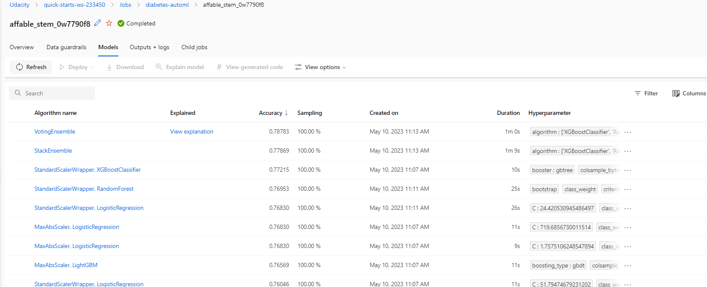
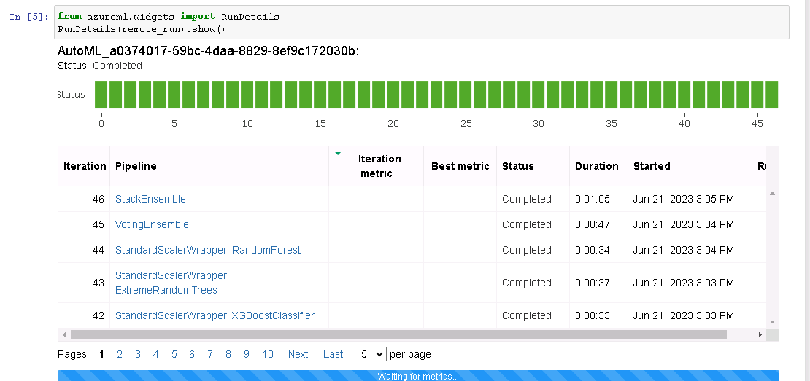
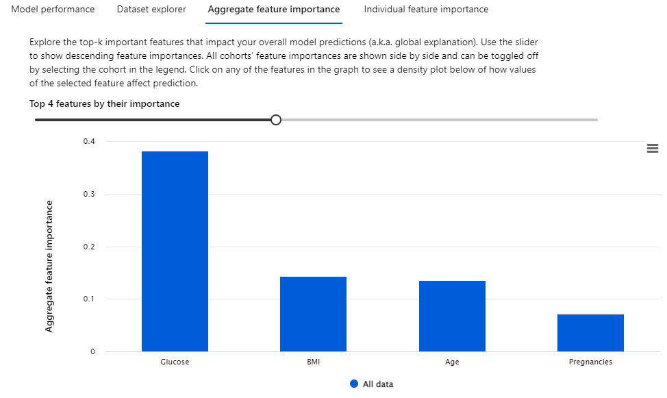
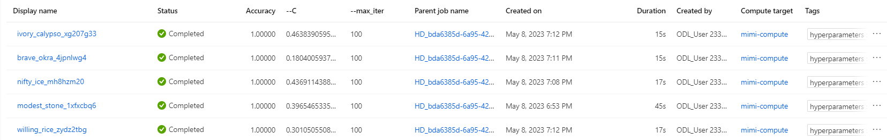
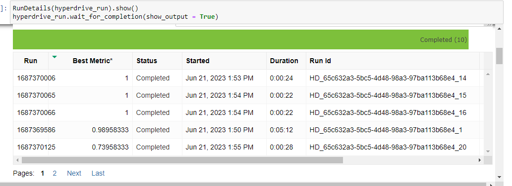
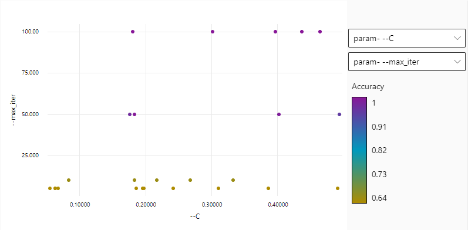
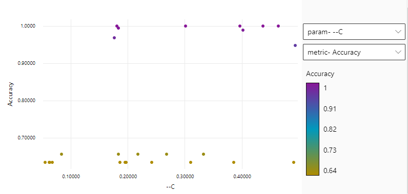
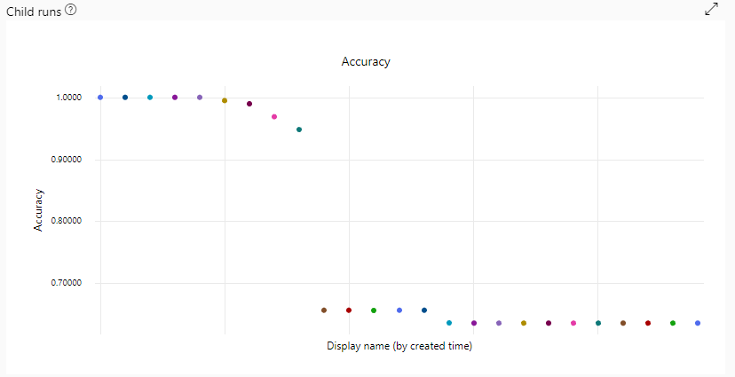
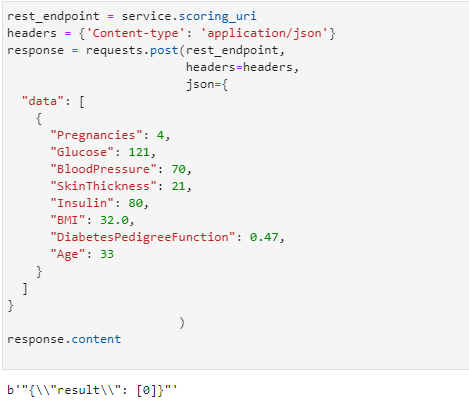
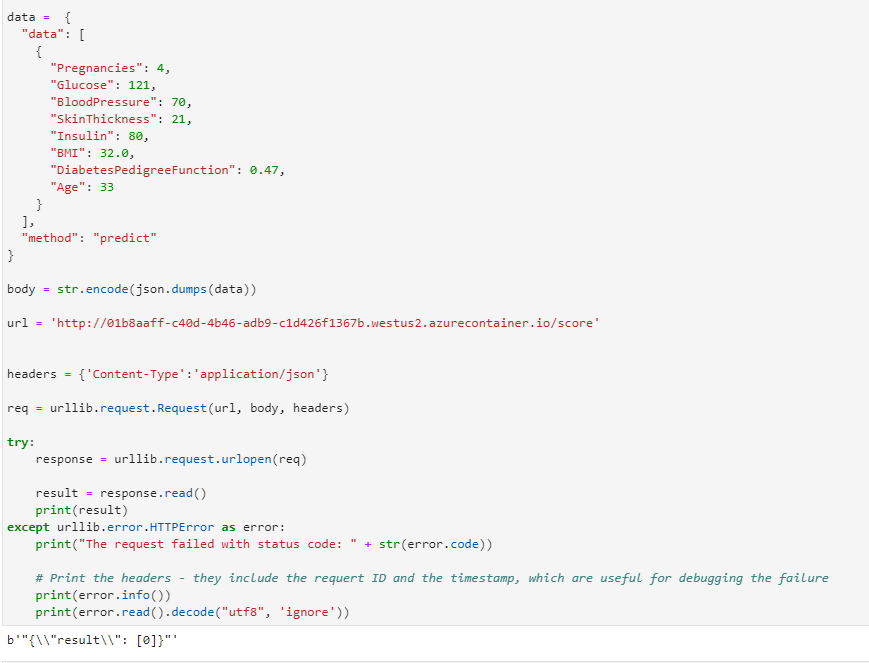

# Predicting Diabetes

This is the Capstone project for Machine Learning Engineer for Azure Nanodegree by Udacity. In this project, I will use AutoML and HyperDrive to train models to predict whether a person has diabetes.

## Project Set Up and Installation
This dataset can be found at [Kaggle](https://www.kaggle.com/datasets/uciml/pima-indians-diabetes-database) and you must have an account with them in order to download the data.

## Dataset

### Overview
In this project, I will be analyzing which factors are most important in predicting diabetes. This dataset can be found at [Kaggle](https://www.kaggle.com/datasets/uciml/pima-indians-diabetes-database) and is originally from the National Institute of Diabetes and Digestive and Kidney Diseases. This is a subset of a larger database and only contains patients that are females at least 21 years old of Pima Indian heritage.

The dataset contains several medical predictor variables such as BMI, glucose levels, and age, and the outcome variable of whether the patient has diabetes or not.

### Task
Diabetes has affected both sides of my family for many generations and I want to learn the factors that contribute to it besides from being genetically predisposed. This project will allow me to determine which factors are most important and potentially help me avoid the same diagnosis.

### Access
After downloading from Kaggle, I load the data into my Azure ML Studio and read the data from there.

## Automated ML

For my AutoML model, I set my experiment to time out after 30 minutes so that it could finish training within an adeqate amount of time. For the same reason, I also enabled the experiment to stop early if the models are not improving. I set my max number of concurrent iterations to 5 since I provisioned my compute cluster to have the same number of nodes. For my primary metric, I decided to go with accuracy. 

### Results

My best AutoML model used a VotingEnsemble algorithm, yielding an accuracy of 78.8%. While this rate is not necessarily low, I think the model performs poorly in the context of healthcare and medicine. One would want a highly accurate model if it is testing for a disease or condition. In the future, I would use a different primary metric, perhaps AUC since the `Outcome` variable is imbalanced (268 of 768 patients have diabetes). I would also expand the dataset so that it was not filtered to females at least 21 years old of Pima Indian heritage. I believe this would lead to a higher success rate.

*I have had this issue of my run detalis widget not properly showing the widget even though the logs were showing. I've discussed this in the last project and they were okay with it*

To help me ansswer my original question, I looked into the important features of the model. The model found that glucose levels was the most important feature, followed by BMI, age, and number of pregnancies (note that this dataset only contains female patients).

## Hyperparameter Tuning

For this experiment, I used a logistic regression model since my target variable was binary. The hyperparameters that were tuned for the model were the regularization strength and maximum number of iterations. I used the bandit policy as my early termination policy so that my experiment ends based on my given evaluation interval and slack factor and it does not waste unnecessary compute resources. For the parameter sampling method, I used the random sampling method as it would have been the most efficient. For the regularization strength or `C`, I gave a range between 0.05 and 0.5, utlizing uniform sampling. For the maximum number of iterations, I opted for choice sampling and selected 5, 10, 50, and 100. I only allowed the experiment to have a maximum of 25 runs to ensure it will finish in a timely manner.

### Results

The best model with thesse hyperparameters tuned had a value of 0.463 for `C` and 100 for `max_iter`, which resulted with an accuracy of 1. 

*I have had this issue of my run details widget not properly showing the widget even though the logs were showing. I've discussed this in the last project and they were okay with it*

While the acccuracy is higher than my AutoML model, I am not sure if it is entirely accurate as the model is claiming to be 100% accurate. This leads me to believe that the data may be skewed in some areas or have some underlying bias, and we already know that the `Outcome` variable is imbalanced. I could also choose different hyperparamters or vaalues for the ones I've chosen to create a more "accurate" or in this case, less accurate, model. 

Though I'm not entirely sure how these hyperparameters affect the accuracy, it seems that the higher the number of maxximum iterations, the higher the accuravy will be, according to the plot below. The regularization strength does not seem to have a clear pattern, though it could be argued that it needs to be higher. There seems to be 2 clusters of accuracy when shown against `C`, one cluster with the accuracy around 64% and the other closer to 100%. 

## Model Deployment

I deployed my best AutoML model, using the VotingEnsemble algorithm. I was able to test the endpoint by sending a POST request using a sample json input given after deploying the model. I show 2 different ways to test the endpoint, and they both give the same prediction of the patient not having diabetes.

## Screen Recording
My computer does not have a working microphone, so I have added a script below to follow along the screencast, which has been added [here](final-project.mp4). 

0:00:00
After deploying my AutoML Model, here I am showing that my endpoint has been deployed successfully and it is healthy.

0:00:12
Here I am showing the 2 different ways Azure ML Studio provides for us to consume the endpoint and the logs to show that it is active when sending requests.

0:00:45
Here I am showing sending a request to the endpoint and the response it gives. It classified this patient as not having diabetes.
